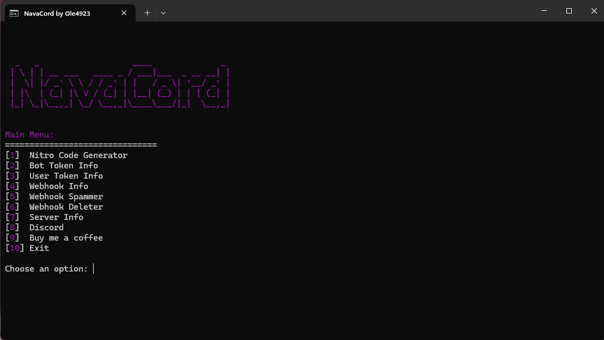

# Project Title

A brief description of what your project does and who it's for.

## Screenshot

Here is a screenshot of the project in action:

## Installation

To install, simply download the entire project as a ZIP file and run the `.cmd` file.

## Usage

Instructions on how to use the project.

## Contributing

This project is free for everyone. Feel free to contribute!

## License

This project is open source and free to use.
